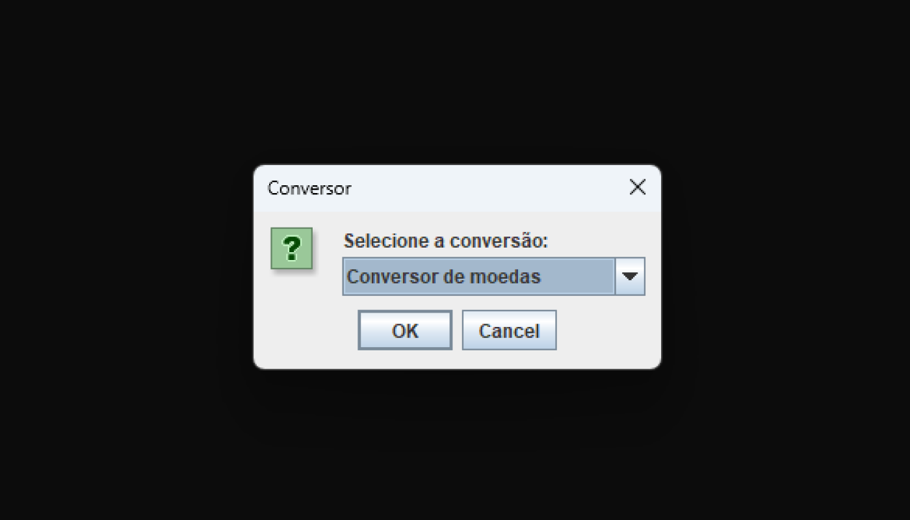

# Challenge ONE | Java - Conversor de Moedas, Medidas e Temperatura

Este projeto é um Conversor de Moedas, Medidas e Temperatura desenvolvido por mim, Gabriel Ribeiro, para o primeiro Challenge da Trilha de Java do Programa Oracle ONE.

Este projeto permite ao usuário:
<ul>
  <li>Converter moedas</li>
  <li>Converter medidas</li>
  <li>Converter entre unidades de temperatura</li>
</ul>

As conversões suportadas são:

Entre moedas:
<ul>
  <li>De Real para Euro</li>
  <li>De Real para Libra</li>
  <li>De Real para Dólar Americano</li>
  <li>De Real para Yene</li>
  <li>De Real para Dólar Australiano</li>
</ul>

Entre medidas:
<ul>
  <li>Quilômetros para Metros</li>
  <li>Quilômetros para Centímetros</li>
  <li>Metros para Quilômetros</li>
  <li>Metros para Centímetros</li>
  <li>Centímetros para Quilômetros</li>
  <li>Centímetros para Metros</li>
</ul>

Entre unidades de temperatura:
<ul>
  <li>Celsius para Kelvin</li>
  <li>Celsius para Fahrenheit</li>
  <li>Kelvin para Celsius</li>
  <li>Kelvin para Fahrenheit</li>
  <li>Fahrenheit para Celsius</li>
  <li>Fahrenheit para Kelvin</li>
</ul>

Para conferir baixar e executar o projeto sem burocarcia
acesse: <a href='https://gabriersdev.github.io/home-page-Conversor/' target='blank'>https://gabriersdev.github.io/home-page-Conversor/ </a>

